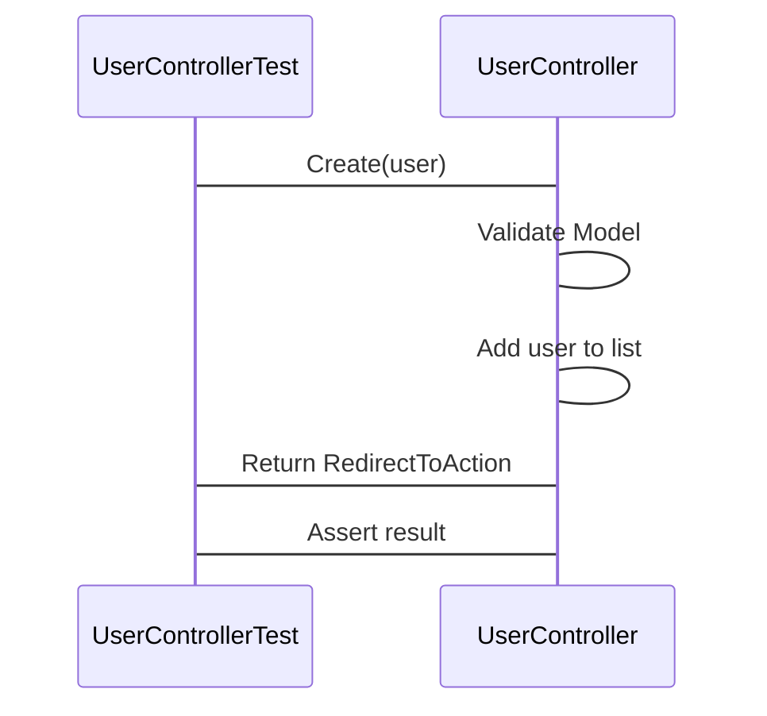

# Contact Database Application

This is a simple ASP.NET MVC application that allows you to manage a list of users.

## Features

- List all users
- View details of a user
- Create a new user
- Edit a user
- Delete a user

## Controllers

The main logic of the application is in the `UserController`. It has actions for listing, creating, editing, and deleting users.

## Tests

The application includes a set of unit tests in the `UserControllerTest` class. These tests cover the basic functionality of the `UserController`.

